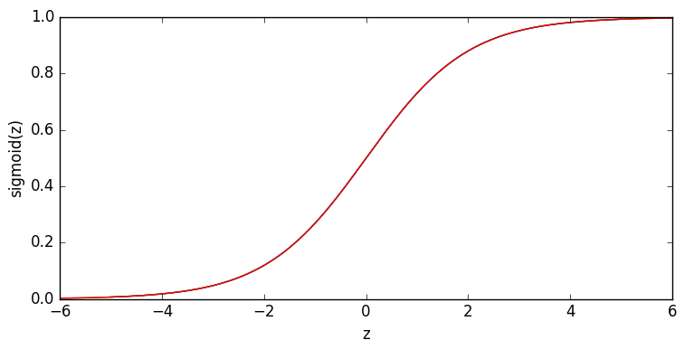
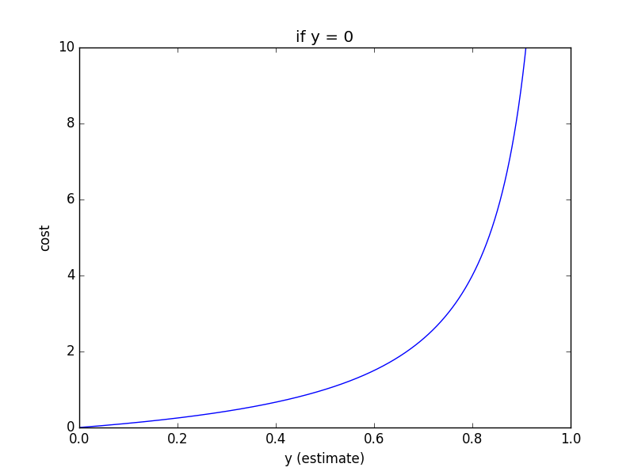
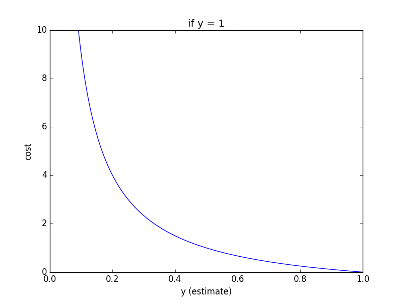
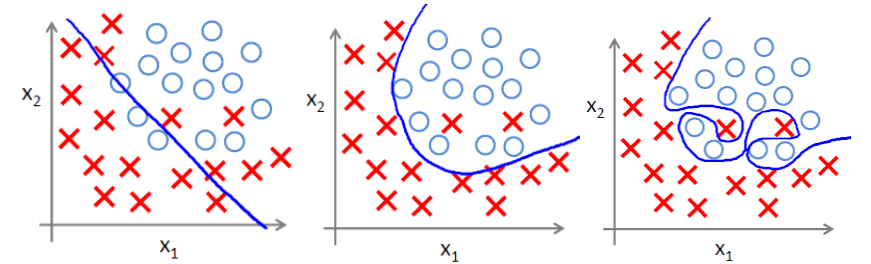

# Logistic Regression
Logistic regression is an approach to*classification* problem rather than a quantative prediction. More confusingly speeking, logistic regression is NOT used to solve regression problems.

Typically, the logistic regression is used to solve *binary classification* problem, that is, the output only have two levels, high or low, good or bad, be or not be, etc..

* *Pros* 
	- Easy to understand and complete in code; 
	- Requires little on computing power. 
* *Cons*
	- Easily get [*overfitting*](https://en.wikipedia.org/wiki/Overfitting)
	- Low accuracy at *rapid growth part*

## Model
### Sigmoid Function
In classification problem, we want the model to accept every input and gives out a possibility of a certain class that the inputs indicates. *Unit step function* is a choice but it is hard for us to handle the step. *Sigmoid function* has similar property but a much gentle way of the step.
\begin{equation}
\sigma (z) = \dfrac{1}{1+e^{-z}}
\end{equation}
and the curve shows as 

The sigmoid function has a good property on derivative.

$$\sigma (z)'= \sigma (z)(1-\sigma (z))$$

Note that $\sigma(z)$ can be recognized as the posibility for one certain class.

### Decision Boundary
In most cases, we treat two classes with equal significance and therefore, we use 0.5 as our decision boundary. That is, $\sigma(z) \ge 0.5 \rightarrow \hat{y} = 1$ and $\sigma(z) < 0.5 \rightarrow \hat y = 0$

### The Logistic Model
The input of sigmoid function is denoted as $z$ and given as following,
\begin{equation}
	z = \theta_0 + \sum\limits_{j=1}^{n} \theta_i x_j^{(i)}
\end{equation}

Combining equation (1) and (2) and take logarithm of both side we could get 
\begin{equation}
	log(\dfrac{\sigma(x^{(i)})}{1-\sigma (x^{(i)})}) = \theta_0 + \sum\limits_{j=1}^{n} \theta_i x_j^{(i)}
\end{equation}

where $\vec{x} = (1, x_1, x_2, ..., x_n)^T$. The left hand side is called log-odds or logit.

Therefore, the logistic regression can be modelled as,
$$\hat{y}^{(i)} = \sigma(\theta^Tx^{(i)}) = \dfrac{1}{1+e^{\theta_0 + \sum\limits_{j=1}^{n} \theta_j x_j^{(i)}}} $$

## Coefficient Estimation
In classification problem, we should expect the cost as large as possible if the classification is wrong. The pictures below gives a brief view of the cost.

By using a small math trick, we could combine the two situation above together. Cost function could be shown as,

$$J(\theta) = \dfrac{1}{m}(-y^Tlog(\hat y) - (1-y)^Tlog(1-\hat y))$$

where $y$ and $\hat y$ are true and predicted vector. We can find that when one element in $y$ is 0, then we will messure how far is the corresponding esitimated value from 0 and vice versa. Only one item in $J(\theta)$ exists given a certain $y^{(i)}$. Logarithm is used to avoid computation among large numbers.

#### Gradient Descent
Overall, the gradient descent algorithm could represented as 

$$\theta := \theta - \alpha \nabla J(\theta)$$
If we use the gradient descent method to optimize the coefficients, following are the steps.

$$\dfrac{\partial J(\theta)}{\partial \theta_j} = \dfrac{1}{m} \sum\limits_{i=1}^{m}(\hat y^{(i)}-y^{(i)})x^{(i)}_j 
$$and$$
\dfrac{\partial J(\theta)}{\partial \theta}= \dfrac{1}{m} X^T(\vec{\hat{y}} -\vec{y})$$

In every circle, we update $\theta$ by
$$\theta := \theta - \dfrac{\alpha}{m} \dfrac{\partial J(\theta)}{\partial \theta}$$

## Possible Extension

#### Logit

Recall the equation (3), we get $log(\dfrac{\sigma(x^{(i)})}{1-\sigma (x^{(i)})})$. This is so called logit, or log-odds. For more information, [see wikipedia](https://en.wikipedia.org/wiki/Logistic_regression#Logistic_function.2C_odds.2C_odds_ratio.2C_and_logit).

#### Linear Discriminant Analysis 
Though there are several extension of logistic regression to adjust it to multi-class classification problem, Linear Discriminant Analysis is more popular on solving such problems. For more information about LNA, [click here](./Linear_Discriminant_Analysis.html). For more information about Multicalss Classification Logistic Regression, [see wikipedia](https://en.wikipedia.org/wiki/Multinomial_logistic_regression)

#### Other Logistic Regressions
- [Ordered Logistic Regression](https://en.wikipedia.org/wiki/Ordered_logistic_regression) handles ordinal dependent variables
- [Conditional Logistic Regression](https://en.wikipedia.org/wiki/Conditional_logistic_regression) handles matched or stratified data when the strata are small. It is mostly used in the analysis of observational studies
- [Conditional Random Field](https://en.wikipedia.org/wiki/Conditional_random_field) apply logistic model to sets of interdependent variables.

## Potential Problems

#### Overfitting
Overfitting problems is common in cost function in logistic regression model. 

Following image shows *underfit*, *fit*, and *overfit* in sequence.

To overcome the overfit problem, there are two possible ways.

##### Reduce the number of features.
This may casue information lost, the features left should be carefully selected.

##### Rugularization
Keep all the features and add a punishment item to cost function $J(\theta)$. Usually, we use L2 norm as the punishment. The cost function changes to 

$$J(\theta) = \dfrac{1}{2m}(\sum\limits_{i=1}^{m}(\hat y^{(i)}- y^{(i)})^2 + \lambda \sum\limits_{j=1}^{n} \theta_j^2)$$

and corresponding update of theta changes to 

$$\theta_j := \theta_j - \dfrac{\alpha}{m}(\sum\limits_{i=1}^{m}(\hat y^{(i)}- y^{(i)})x_j^{(i)} + \lambda \theta_j)$$

where $\lambda$ is punishment coeffiencient. A larger $\lambda$ punish the model harder and it may lead to underfitting problem, so a proper selection of $\lambda$ is necessary.
